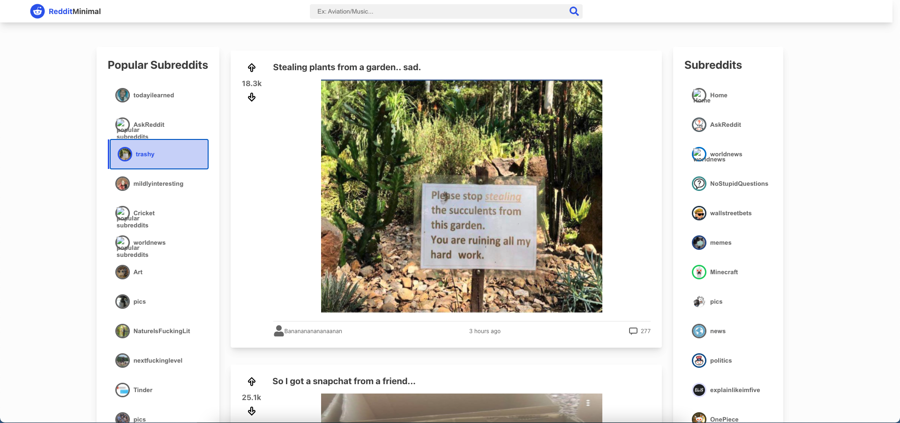

# [Reddit Client](https://linktoproject)

## Description

A front-end web app built with React/Redux utilizing Reddit API displaying data fetched from Reddit.
The app is tested using Enzyme/jest.

## Table of Contents:

- [Description](#description)
- [Technologies](#technologies)
- [Lighthouse Score](#lighthouse-score)

## Technologies

- JavaScript
- React
- Redux
- HTML5
- CSS3
- Axios
- Moment
- React markdown
- Enzyme
- Jest
- Vercel
- Git
- Github

## Lighthouse Score

